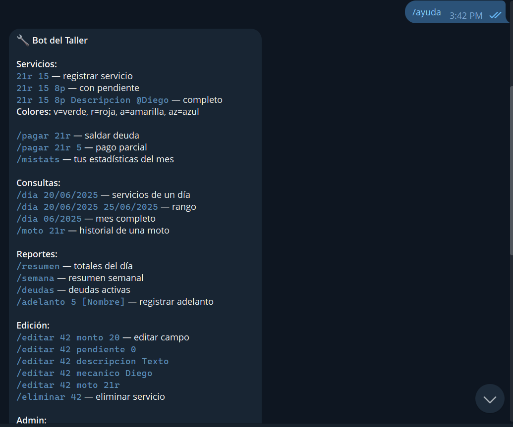
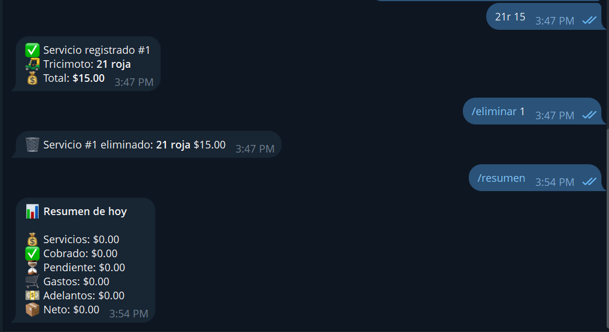

# Bot Taller — El Restaurador

Bot de Telegram para gestión de servicios, pagos y finanzas del taller automotriz **El Restaurador**. Construido con Python, PostgreSQL y desplegado en Railway.

---

## Stack

- **Python 3.13** + `python-telegram-bot 21.5`
- **PostgreSQL** (Railway)
- **Railway** — worker + base de datos

---

## Estructura

```
bot-taller/
├── main.py                  # Entry point, registro de handlers
├── database.py              # Conexión y schema de la DB
├── utils.py                 # Helpers compartidos, decorador de roles
├── handlers/
│   ├── mecanico.py          # Registro de servicios, pagos, stats propias
│   ├── jefe.py              # Reportes, deudas, adelantos
│   ├── admin.py             # Gestión de usuarios, gastos
│   └── consultas.py         # Consultas por fecha/moto, edición, eliminación
├── requirements.txt
└── Procfile
```

---

## Roles y permisos

| Comando | Mecánico | Jefe | Admin |
|---|:---:|:---:|:---:|
| Registrar servicio | ✅ | ✅ | ✅ |
| Registrar pago pendiente | ✅ | ✅ | ✅ |
| Ver stats propias (`/mistats`) | ✅ | ✅ | ✅ |
| Consultar por día/moto (`/dia`, `/moto`) | ✅ | ✅ | ✅ |
| Ver resumen del día (`/resumen`) | ❌ | ✅ | ✅ |
| Ver resumen semanal (`/semana`) | ❌ | ✅ | ✅ |
| Ver deudas (`/deudas`) | ❌ | ✅ | ✅ |
| Registrar adelanto (`/adelanto`) | ❌ | ✅ | ✅ |
| Editar servicio (`/editar`) | ❌ | ✅ | ✅ |
| Eliminar servicio (`/eliminar`) | ❌ | ✅ | ✅ |
| Gestión de usuarios (`/adduser`, `/usuarios`) | ❌ | ❌ | ✅ |
| Registrar gasto (`/gasto`) | ❌ | ❌ | ✅ |

---

## Comandos

### Servicios (texto libre)
```
21r 15                              # tricimoto 21 roja, $15
21r 15 8p                           # con $8 pendiente
21r 15 8p Cambio de aceite          # con descripción
21r 15 8p Cambio de aceite @Diego   # asignado a Diego
```
**Colores/Compañías:** `v`=Comtrilamana (verde), `r`=19 de Mayo (roja), `a`=Quilotoa (amarilla), `az`=Patria Vuelve (azul), `tx`=San Carlos (roja)

### Pagos
```
/pagar 21r          # saldar deuda completa
/pagar 21r 5        # pago parcial de $5
```

### Consultas
```
/dia 20/06/2025                     # servicios de un día
/dia 20/06/2025 25/06/2025          # rango de fechas
/dia 06/2025                        # mes completo
/moto 21r                           # historial de una tricimoto
/mistats                            # estadísticas propias del mes
```

### Reportes (jefe/admin)
```
/resumen            # totales del día
/semana             # resumen semanal
/deudas             # deudas activas
/adelanto 5         # adelanto propio
/adelanto 5 Diego   # adelanto para Diego
```

### Edición (jefe/admin)
```
/editar 42 monto 20
/editar 42 pendiente 0
/editar 42 descripcion Cambio de aceite y filtro
/editar 42 mecanico Diego
/editar 42 moto 21r
/eliminar 42
```

### Admin
```
/adduser @username Nombre rol       # agregar usuario (roles: admin, jefe, mecanico)
/usuarios                           # listar usuarios
/gasto 5 Descripción                # registrar gasto del taller
```

---

## Schema de base de datos

### `usuarios`
| Campo | Tipo | Descripción |
|---|---|---|
| id | SERIAL PK | |
| telegram_id | BIGINT UNIQUE | ID de Telegram |
| username | TEXT | @username de Telegram |
| nombre | TEXT | Nombre para mostrar |
| rol | TEXT | `admin`, `jefe`, `mecanico` |
| is_active | BOOLEAN | Soft enable/disable |
| created_at | TIMESTAMP | |
| updated_at | TIMESTAMP | Auto-actualizado por trigger |
| deleted_at | TIMESTAMP | Soft delete |

### `servicios`
| Campo | Tipo | Descripción                      |
|---|---|----------------------------------|
| id | SERIAL PK |                                  |
| tricimoto_num | TEXT | Número de tricimoto              |
| tricimoto_compania | TEXT | Compañía de tricimoto            |
| monto_total | NUMERIC(10,2) | Total del servicio               |
| monto_pendiente | NUMERIC(10,2) | Saldo pendiente                  |
| descripcion | TEXT | Descripción del trabajo          |
| mecanico_id | FK → usuarios | Mecánico asignado                |
| registrado_por | FK → usuarios | Quien registró                   |
| estado | TEXT | `pendiente`, `pagado`, `anulado` |
| is_active | BOOLEAN | Soft delete flag                 |
| created_at | TIMESTAMP |                                  |
| updated_at | TIMESTAMP | Auto-actualizado por trigger     |
| deleted_at | TIMESTAMP | Soft delete                      |

### `pagos`
| Campo | Tipo | Descripción |
|---|---|---|
| id | SERIAL PK | |
| servicio_id | FK → servicios | |
| monto | NUMERIC(10,2) | |
| registrado_por | FK → usuarios | |
| is_active | BOOLEAN | |
| created_at | TIMESTAMP | |
| deleted_at | TIMESTAMP | |

### `gastos`
| Campo | Tipo | Descripción |
|---|---|---|
| id | SERIAL PK | |
| tipo | TEXT | `gasto`, `adelanto` |
| monto | NUMERIC(10,2) | |
| descripcion | TEXT | |
| registrado_por | FK → usuarios | |
| is_active | BOOLEAN | |
| created_at | TIMESTAMP | |
| updated_at | TIMESTAMP | |
| deleted_at | TIMESTAMP | |

### `logs`
| Campo | Tipo | Descripción |
|---|---|---|
| id | SERIAL PK | |
| accion | TEXT | `EDITAR`, `ELIMINAR`, etc. |
| tabla | TEXT | Tabla afectada |
| registro_id | INTEGER | ID del registro afectado |
| detalle | TEXT | Descripción del cambio |
| registrado_por | FK → usuarios | |
| created_at | TIMESTAMP | |

---

## Despliegue en Railway

### 1. Variables de entorno (worker)
```
BOT_TOKEN=tu_token_de_telegram
DATABASE_URL=${{Postgres.DATABASE_URL}}
```

### 2. Primer admin
Ejecutar en la consola de PostgreSQL de Railway:
```sql
INSERT INTO usuarios (telegram_id, username, nombre, rol)
VALUES (TU_TELEGRAM_ID, 'tu_username', 'TuNombre', 'admin');
```

### 3. Agregar usuarios desde el bot
```
/adduser @username Nombre mecanico
/adduser @username Nombre jefe
```

---

## Screenshots




## Notas

- El bot usa **soft delete** — los registros eliminados no se borran físicamente, se marcan con `is_active = FALSE` y `deleted_at`.
- `updated_at` se actualiza automáticamente via triggers de PostgreSQL.
- Los mecánicos solo ven sus propios registros en `/dia` y `/moto`.
- Toda edición y eliminación queda registrada en la tabla `logs`.